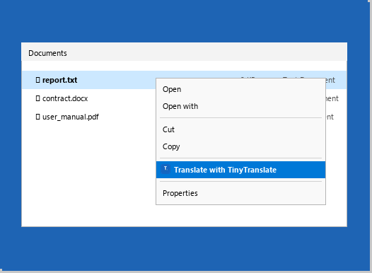
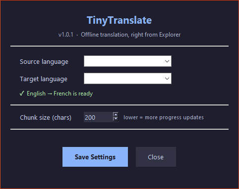

# TinyTranslate

Right-click any `.txt`, `.docx`, or `.pdf` → pick a language → translated offline → saved as `filename_FR.txt`. No API key. No cloud. Uses [Argos Translate](https://github.com/argosopentech/argos-translate) local models. Language packs auto-download on first use.

## Screenshots

**Right-click any document in Explorer:**



**Translation progress window:**


**Settings — change language, install new packs:**



## How it works

1. Right-click any `.txt`, `.docx`, or `.pdf` → **"Translate with TinyTranslate"** → pick a language
2. If the language pack isn't downloaded yet, it downloads automatically (~100 MB, one-time)
3. A progress window shows translation status — no console, no flash
4. Output saved in the same folder — `report.txt` → `report_FR.txt`
5. **Add more languages** from the bottom of the flyout or the Settings window

## Install

### Option A — one-click installer (recommended)

Download `TinyTranslate-Setup.exe` from the [latest release](https://github.com/dvlce/tinytranslate/releases/latest) and run it. Registers the right-click menu, creates shortcuts, no admin needed, no Python required.

### Option B — from source

```powershell
git clone https://github.com/dvlce/tinytranslate.git
cd tinytranslate
powershell -ExecutionPolicy Bypass -File install.ps1
```

The installer will:
- Create a Python virtual environment (`.venv`)
- Install all dependencies
- Download the EN→FR language pack (~100 MB, one-time)
- Generate the app icon
- Register the right-click menu under HKCU **(no admin required)**
- Create Desktop and Start Menu shortcuts to the Settings window

**Total disk footprint: ~150 MB** (language pack + venv)

## Requirements

- Windows 10 / 11
- Python 3.8+
- Internet for first-time model download, **offline forever after**

## Config

`config.json` is created from the example on first install (gitignored — never committed):

| Key | Default | Description |
|---|---|---|
| `source_lang` | `"en"` | Source language code |
| `target_lang` | `"fr"` | Target language code |
| `chunk_size` | `1500` | Characters per translation chunk (lower = more progress updates) |

Change these from **TinyTranslate Settings** (Desktop shortcut) or edit `config.json` directly.

## Supported languages

Any pair available in the [Argos Translate package index](https://github.com/argosopentech/argos-translate#supported-languages). Common pairs:

| Code | Language | Code | Language |
|------|----------|------|----------|
| `en` | English  | `de` | German   |
| `fr` | French   | `it` | Italian  |
| `es` | Spanish  | `pt` | Portuguese |
| `ru` | Russian  | `zh` | Chinese  |
| `ja` | Japanese | `ko` | Korean   |
| `ar` | Arabic   | `nl` | Dutch    |
| `pl` | Polish   | `tr` | Turkish  |

Install additional packs from the Settings window (Downloads button) or manually:

```powershell
.venv\Scripts\python.exe download_model.py en de
```

## Output format

| Input | Output |
|---|---|
| `report.txt` | `report_FR.txt` |
| `contract.docx` | `contract_FR.txt` |
| `user_manual.pdf` | `user_manual_FR.txt` |

Output is always plain UTF-8 text. Docx formatting is not preserved (text content only).

> **PDF note:** Image-only / scanned PDFs cannot be extracted. A text layer is required.

## Disk usage

| Component | Size |
|---|---|
| Python venv (deps) | ~50 MB |
| EN→FR language pack | ~100 MB |
| Each additional language pair | ~100 MB |

## Project Structure

| File | Description |
|---|---|
| `tinytranslate.py` | Main translation entrypoint (invoked by the right-click menu) |
| `tinytranslate.ps1` | PowerShell wrapper launched by the shell registration |
| `config.py` | Config loader / writer (reads `config.json`) |
| `install.ps1` / `uninstall.ps1` | Shell-menu registration scripts (HKCU, no admin) |
| `download_model.py` | Manual Argos language-pack download helper |
| `config.json` | User settings (source/target language, chunk size) — gitignored |
| `.venv/` | Python virtual environment (created by installer) |

## Uninstall

```powershell
powershell -ExecutionPolicy Bypass -File uninstall.ps1
```

Removes the context menu entries and shortcuts. Your `.venv` and `config.json` are left intact.
Delete the `TinyTranslate` folder to remove everything.
Language model files remain at `%LOCALAPPDATA%\argos-translate` — delete that folder manually to free the space.
